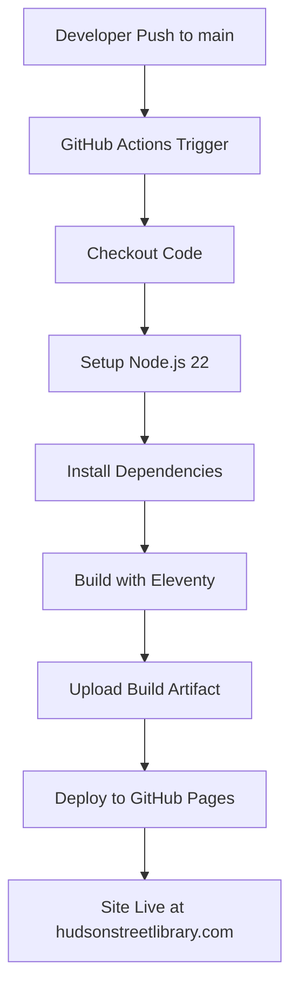

# GitHub Actions Deployment Pipeline

## Overview

The Hudson Street Library website uses GitHub Actions for automated deployment. Every push to the `main` branch triggers a build and deployment process that compiles the Eleventy site and deploys it to GitHub Pages.

## Pipeline Architecture



## Workflow Configuration

### File Location
`.github/workflows/build-and-deploy.yml`

### Workflow Details

**Name:** `Build and Deploy to GitHub Pages`

**Triggers:**
- Push to `main` branch
- Manual workflow dispatch (can be triggered from Actions tab)

**Permissions:**
- `contents: read` - Read repository content
- `pages: write` - Deploy to GitHub Pages
- `id-token: write` - Required for GitHub Pages deployment

**Concurrency:**
- Group: `pages`
- Cancel in progress: `false` (allows deployments to complete)

## Build Job

### Environment
- **OS:** `ubuntu-latest`
- **Node.js:** Version 22 with npm caching (required by Eleventy v3)

### Steps

1. **Checkout Repository**
   ```yaml
   - name: Checkout
     uses: actions/checkout@v4
   ```

2. **Setup Node.js**
   ```yaml
   - name: Setup Node.js
     uses: actions/setup-node@v4
     with:
       node-version: '22'
       cache: 'npm'
   ```

3. **Install Dependencies**
   ```bash
   npm ci  # Clean install from package-lock.json
   ```

4. **Build Site**
   ```bash
   npx eleventy  # Build static site to _site/
   ```

5. **Upload Artifact**
   - Uploads `_site/` directory as GitHub Pages artifact
   - Uses `actions/upload-pages-artifact@v3`

## Deploy Job

### Environment
- **Name:** `github-pages`
- **URL:** Dynamic (provided by deployment action)
- **Dependencies:** Requires successful build job

### Steps

1. **Deploy to GitHub Pages**
   ```yaml
   - name: Deploy to GitHub Pages
     id: deployment
     uses: actions/deploy-pages@v4
   ```

## Monitoring and Troubleshooting

### Viewing Workflow Status

1. Go to your repository on GitHub
2. Click the **"Actions"** tab
3. View recent workflow runs

### Workflow Status Indicators

- ✅ **Green checkmark:** Successful deployment
- ❌ **Red X:** Failed deployment
- 🟡 **Yellow circle:** In progress
- ⏸️ **Gray dash:** Skipped or cancelled

### Common Build Failures

#### 1. Node.js Dependencies Issues
**Error:** `npm ci` fails
**Solution:** 
- Check `package-lock.json` is committed
- Verify Node.js version compatibility
- Update dependencies if needed

#### 2. Eleventy Build Errors
**Error:** Eleventy compilation fails
**Solution:**
- Test build locally: `npm run build`
- Check for syntax errors in templates
- Verify data files (CSV/JSON) are properly formatted
- Check file paths and references

#### 3. Missing Files
**Error:** Files not found during build
**Solution:**
- Ensure all referenced assets exist in `src/assets/`
- Check image paths in HTML files
- Verify CSV data file exists at `src/_data/books.csv`

#### 4. Deployment Failures
**Error:** Pages deployment fails
**Solution:**
- Check GitHub Pages is configured to use "GitHub Actions"
- Verify repository has Pages enabled
- Check for any policy restrictions

### Debugging Steps

1. **Check Build Logs:**
   - Click on failed workflow run
   - Expand "Build" job
   - Review each step for error messages

2. **Test Locally:**
   ```bash
   npm ci
   npm run build
   ```

3. **Check File Structure:**
   ```bash
   # Verify source files exist
   ls src/
   ls src/_data/
   ls src/assets/
   ```

## Performance and Optimization

### Build Time Optimization

**Current build time:** ~30-60 seconds

**Optimizations in place:**
- npm caching (speeds up dependency installation)
- Artifact compression
- Efficient Node.js setup

### Resource Usage

**Compute:** GitHub-hosted runners (free tier)
**Storage:** Artifact storage (temporary, cleaned automatically)
**Bandwidth:** GitHub Pages hosting (free tier)

## Security Considerations

### Permissions
- Minimal required permissions granted
- No secrets or credentials stored in workflow
- Read-only access to repository content

### Dependencies
- Dependencies installed from `package-lock.json` (locked versions)
- Official GitHub Actions used
- No third-party actions with broad permissions

## Configuration Files

### Package.json Scripts
```json
{
  "scripts": {
    "start": "eleventy --serve",
    "build": "eleventy",
    "clean": "rm -rf _site"
  }
}
```

### Eleventy Configuration
- Input directory: `src/`
- Output directory: `_site/`
- Template formats: `njk`, `html`, `liquid`, `md`

## Deployment History

### Tracking Deployments

**GitHub Pages Environment:**
- View deployment history in repository Settings → Environments → github-pages
- Each deployment shows commit SHA, timestamp, and status

**Actions History:**
- Complete workflow runs available in Actions tab
- Build logs retained for 90 days (GitHub default)

### Rollback Process

If deployment issues occur:

1. **Quick Rollback:**
   ```bash
   git revert HEAD
   git push origin main
   ```

2. **Revert to Specific Commit:**
   ```bash
   git revert <commit-sha>
   git push origin main
   ```

3. **Emergency Disable:**
   - Disable GitHub Pages in repository settings
   - Fix issues locally
   - Re-enable when ready

## Maintenance

### Regular Tasks

**Monthly:**
- Review dependency updates
- Check for GitHub Actions updates
- Monitor build performance

**As Needed:**
- Update Node.js version in workflow
- Optimize build process
- Review and update documentation

### Updating the Workflow

1. Edit `.github/workflows/build-and-deploy.yml`
2. Test changes locally if possible
3. Commit and push to see results
4. Monitor first run carefully

## Integration with Development Workflow

### Branch Protection

Recommended repository settings:
- Require status checks before merging
- Require branches to be up to date
- Include "Build and Deploy" check

### Development Process

1. **Feature Development:**
   ```bash
   git checkout -b feature-branch
   # Make changes
   npm start  # Test locally
   git commit -m "Feature description"
   git push origin feature-branch
   ```

2. **Pull Request:**
   - Create PR to `main`
   - Review changes
   - Merge when ready

3. **Automatic Deployment:**
   - Merge triggers deployment
   - Site updates automatically
   - Monitor deployment status

## Support and Resources

### GitHub Documentation
- [GitHub Actions Documentation](https://docs.github.com/en/actions)
- [GitHub Pages Documentation](https://docs.github.com/en/pages)

### Eleventy Documentation
- [Eleventy Documentation](https://www.11ty.dev/docs/)
- [Eleventy Deploy Guide](https://www.11ty.dev/docs/deployment/)

### Contact
- For technical issues: Create issue in this repository
- For library content: Use website contact form