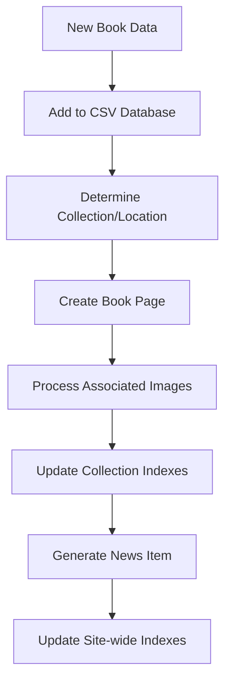

# News Pipeline System Documentation

This document provides comprehensive documentation for the automated news generation system at Hudson Street Library.

## Overview

The news pipeline system automatically generates news items when books are added to the collection, creating a seamless workflow from book acquisition to public announcement. Implemented in January 2025, this system integrates with the existing CSV database and collection structure to provide automated announcements for new acquisitions, collection updates, and library announcements.

**Key Features Implemented:**
- **7-Step Workflow**: Complete automation from database addition to site integration
- **Smart Categorization**: Automatic collection detection based on book subjects and keywords
- **Featured Logic**: Intelligent highlighting of significant acquisitions
- **CLI Tools**: Comprehensive command-line interface for testing and manual operations
- **Integration**: Seamless connection with existing Eleventy build process and GitHub Pages deployment

## System Architecture

### Core Components

1. **NewsGenerator** (`/scripts/news-pipeline/news-generator.js`)
   - Generates contextual news content from book metadata
   - Smart categorization and featuring logic
   - Template-based content generation

2. **BookEventPipeline** (`/scripts/news-pipeline/event-pipeline.js`) 
   - Complete book addition workflow automation
   - 7-step pipeline from database to news generation
   - Integration with collection and index systems

3. **CLI Interface** (`/scripts/news-pipeline/cli.js`)
   - Command-line tools for testing and manual operations
   - Batch processing capabilities
   - Development and debugging utilities

## Pipeline Workflow

### Automated Book Addition Process



### Step-by-Step Process

1. **Database Addition**: Book metadata added to `_data/books.csv`
2. **Collection Assignment**: Automatic categorization based on subjects/keywords
3. **Page Creation**: Generate individual book page using template
4. **Image Processing**: Handle cover images and optimization
5. **Index Updates**: Update collection-specific indexes
6. **News Generation**: Create contextual news announcement
7. **Site Integration**: Update site-wide navigation and indexes

## News Generation Logic

### Content Generation

The system automatically generates:
- **Title**: Contextual based on collection and book type
- **Excerpt**: Brief description highlighting key aspects
- **Content**: Full announcement with book details and availability
- **Category**: Auto-assigned based on event type
- **Featured Status**: Smart logic for high-impact acquisitions

### Categorization Rules

```javascript
// Collection-based categorization
const collectionCategories = {
    'fashion': 'acquisitions',
    'photography': 'acquisitions', 
    'art': 'acquisitions',
    'ephemera': 'acquisitions',
    'music': 'acquisitions',
    'queer': 'acquisitions',
    'design': 'acquisitions'
};

// Featured item logic
const shouldFeature = (bookData, collection) => {
    // Rare or significant publications
    if (bookData.publisher?.includes('Aperture') || 
        bookData.publisher?.includes('Steidl')) return true;
    
    // First book in new collection
    if (isFirstInCollection(collection)) return true;
    
    // Major artist/photographer
    if (isMajorArtist(bookData.author)) return true;
    
    return false;
};
```

### Content Templates

#### Standard Acquisition
```
We're pleased to announce the acquisition of "{title}" by {author} ({publisher}, {year}). 
This important work joins our {collection} collection. {description} 
The book is now available for viewing by appointment.
```

#### Featured Acquisition
```
We're excited to announce a significant addition to our collection: "{title}" by {author}. 
This {year} publication from {publisher} represents {significance}. 
{detailed_description} Available for research visits by appointment.
```

## Data Structure

### News Item Schema

```json
{
    "id": "number",
    "date": "YYYY-MM-DD",
    "category": "acquisitions|collections|announcements", 
    "featured": "boolean",
    "title": "string",
    "excerpt": "string",
    "content": "string",
    "image": "string|null"
}
```

### Event Types

- **acquisition**: New book added to collection
- **collection**: Collection reorganization or updates
- **announcement**: General library announcements
- **exhibition**: Special displays or features

## Command Line Interface

### Basic Commands

```bash
# Generate news from single book
node scripts/news-pipeline/cli.js generate-single \
  --title "Book Title" \
  --author "Author Name" \
  --collection "photography"

# Process CSV file
node scripts/news-pipeline/cli.js process-csv \
  --file "_data/books.csv" \
  --start-row 10

# Test with sample data
node scripts/news-pipeline/cli.js test-generation

# Complete book addition workflow
node scripts/news-pipeline/cli.js add-book \
  --csv-row "Author,Title,Publisher,Year,Subject" \
  --auto-categorize
```

### Advanced Options

```bash
# Batch processing with filtering
node scripts/news-pipeline/cli.js batch-process \
  --collection "fashion" \
  --date-range "2024-01-01,2024-12-31" \
  --featured-only

# Development utilities
node scripts/news-pipeline/cli.js validate-news
node scripts/news-pipeline/cli.js check-duplicates
node scripts/news-pipeline/cli.js regenerate-indexes
```

## Configuration

### Collection Mapping

```javascript
const collectionMapping = {
    'fashion': ['fashion', 'clothing', 'design', 'comme des garcons', 'matsuda'],
    'photography': ['photography', 'photobook', 'photos', 'street photography'],
    'art': ['art', 'artist', 'painting', 'sculpture', 'contemporary'],
    'music': ['music', 'musician', 'concert', 'album', 'sound'],
    'queer': ['queer', 'lgbt', 'gay', 'lesbian', 'transgender'],
    'ephemera': ['ephemera', 'postcards', 'invitations', 'flyers'],
    'nyc': ['new york', 'manhattan', 'brooklyn', 'nyc', 'urban']
};
```

### News Categories

```javascript
const newsCategories = {
    acquisitions: {
        color: 'blue',
        icon: 'fa-plus-circle',
        description: 'New additions to the collection'
    },
    collections: {
        color: 'green', 
        icon: 'fa-folder-open',
        description: 'Collection updates and reorganization'
    },
    announcements: {
        color: 'orange',
        icon: 'fa-bullhorn', 
        description: 'General library announcements'
    }
};
```

## Integration Points

### With Existing Systems

1. **CSV Source** (`src/_data/books.csv`)
   - Primary source of book metadata
   - Automatic news generation on new entries

2. **Collection Pages** (`src/collections/*.html`)
   - News items reference collection pages
   - Automatic linking and cross-references

3. **Image Pipeline** (`scripts/image-pipeline/`)
   - Coordinated with cover image processing
   - Automatic image optimization for news items

4. **Site Building** (Eleventy)
   - News data feeds into site templates
   - Automatic page regeneration

### File Dependencies

```
src/_data/news.json              # Primary news data store
src/_data/books.csv              # Book metadata source
scripts/news-pipeline/           # Core pipeline modules
src/news.html                    # News page template
src/_includes/layouts/news.njk   # Individual news item layout
src/collection-explore.html      # Collection index integration
```

## API and Data Access

### Reading News Data

```javascript
// Load all news items (in scripts at repo root)
const newsData = require('./src/_data/news.json');

// Filter by category
const acquisitions = newsData.filter(item => item.category === 'acquisitions');

// Get featured items
const featured = newsData.filter(item => item.featured === true);

// Sort by date (newest first)
const sorted = newsData.sort((a, b) => new Date(b.date) - new Date(a.date));
```

### Adding News Items

```javascript
const NewsGenerator = require('./scripts/news-pipeline/news-generator');
const generator = new NewsGenerator();

// From book data
await generator.generateNewsFromBook(bookData, 'acquisition');

// Manual creation
const newsItem = {
    title: "Custom Announcement",
    excerpt: "Brief description", 
    content: "Full content",
    category: "announcements",
    featured: false
};

await generator.addNewsItem(newsItem);
```

## Testing and Validation

### Automated Tests

```bash
# Run test suite
npm test news-pipeline

# Validate news data integrity
node scripts/news-pipeline/validate.js

# Check for duplicate entries
node scripts/news-pipeline/check-duplicates.js
```

### Manual Testing

```bash
# Test news generation
node scripts/news-pipeline/cli.js test-generation

# Validate specific book
node scripts/news-pipeline/cli.js validate-book --id 123

# Preview news item
node scripts/news-pipeline/cli.js preview --book-data "csv-row-data"
```

## Performance Considerations

### Optimization Strategies

1. **Batch Processing**: Process multiple books in single operation
2. **Caching**: Cache generated content to avoid regeneration
3. **Lazy Loading**: Generate news items only when needed
4. **Rate Limiting**: Prevent excessive API calls during bulk operations

### Memory Management

```javascript
// Process in batches to manage memory
const batchSize = 50;
for (let i = 0; i < books.length; i += batchSize) {
    const batch = books.slice(i, i + batchSize);
    await processBatch(batch);
}
```

## Error Handling

### Common Issues and Solutions

1. **Invalid CSV Data**
   - Solution: Data validation before processing
   - Fallback: Skip invalid rows with logging

2. **Duplicate News Items**
   - Solution: Duplicate detection based on title + date
   - Fallback: Append unique identifier

3. **Missing Collection Data**
   - Solution: Default to 'general' collection
   - Fallback: Manual categorization queue

4. **Template Errors**
   - Solution: Fallback to basic template
   - Logging: Detailed error reporting

### Error Logging

```javascript
// Structured error logging
const logError = (error, context) => {
    console.error(`[NEWS-PIPELINE] ${error.message}`, {
        timestamp: new Date().toISOString(),
        context: context,
        stack: error.stack
    });
};
```

## Deployment and Maintenance

### Regular Maintenance Tasks

1. **Weekly**: Review auto-generated news items for accuracy
2. **Monthly**: Validate news data integrity
3. **Quarterly**: Update collection mapping based on new acquisitions
4. **Annually**: Archive old news items to maintain performance

### Deployment Checklist

- [ ] Test pipeline with sample data
- [ ] Validate news.json structure
- [ ] Check collection links and references
- [ ] Verify image paths and optimization
- [ ] Test CLI commands
- [ ] Validate site build process

## Future Enhancements

### Planned Features

1. **RSS Feed Generation**: Automatic RSS/Atom feed creation
2. **Email Notifications**: Subscriber notifications for new items
3. **Social Media Integration**: Automatic posting to social platforms
4. **Advanced Analytics**: Track popular news items and collections
5. **Multi-language Support**: Generate news in multiple languages

### Integration Possibilities

1. **CMS Integration**: Connect with headless CMS for editing
2. **Analytics Tracking**: Google Analytics event tracking
3. **Search Integration**: Full-text search within news content
4. **API Endpoints**: RESTful API for external access

## Troubleshooting Guide

### Common Problems

**Problem**: News items not appearing on site
- **Check**: Verify `_data/news.json` is valid JSON
- **Fix**: Run `npx eleventy` to rebuild site

**Problem**: Duplicate news items generated  
- **Check**: Run duplicate detection script
- **Fix**: Remove duplicates and update generation logic

**Problem**: Missing collection references
- **Check**: Verify collection mapping configuration
- **Fix**: Update mapping or manually assign collection

**Problem**: CLI commands failing
- **Check**: Node.js version and dependency installation
- **Fix**: `npm install` and check Node.js >= 14

### Debug Mode

```bash
# Enable debug logging
DEBUG=news-pipeline node scripts/news-pipeline/cli.js test-generation

# Verbose output
node scripts/news-pipeline/cli.js --verbose generate-single --title "Test"
```

## Support and Documentation

### Getting Help

1. **Internal Documentation**: This file and inline code comments
2. **Error Logs**: Check console output for detailed errors
3. **Test Suite**: Run tests to validate system state
4. **CLI Help**: `node scripts/news-pipeline/cli.js --help`

### Contributing

When modifying the news pipeline:

1. Update this documentation
2. Add tests for new features
3. Validate with sample data
4. Check integration with existing systems
5. Update CLI help text

---

*Last updated: January 2025*
*Version: 1.0.0*